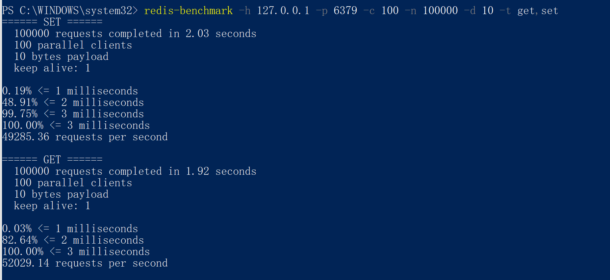
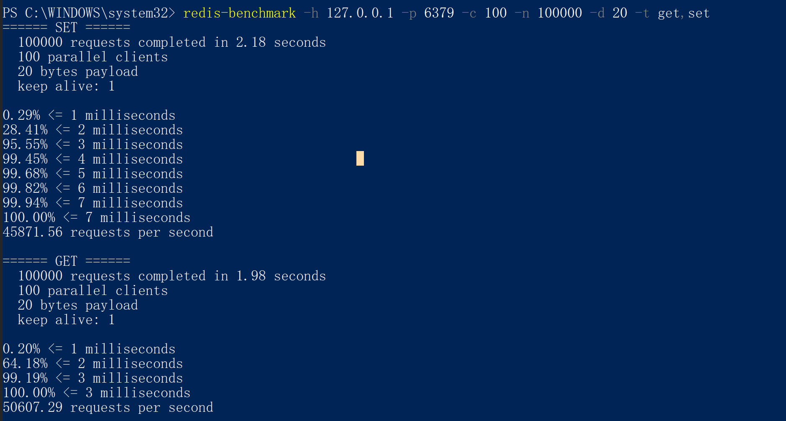
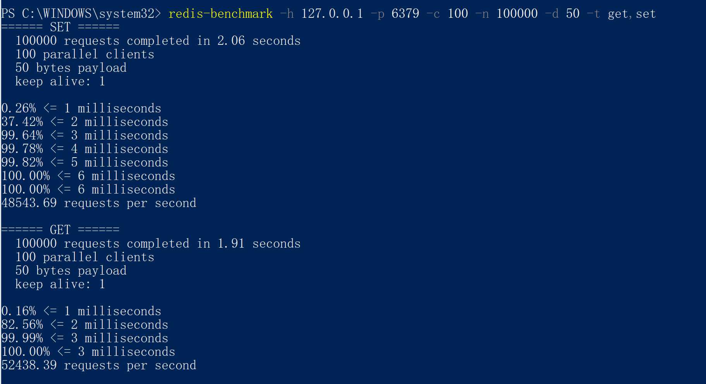
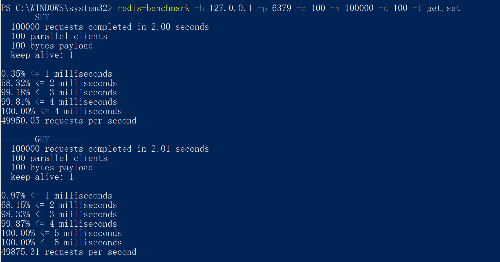
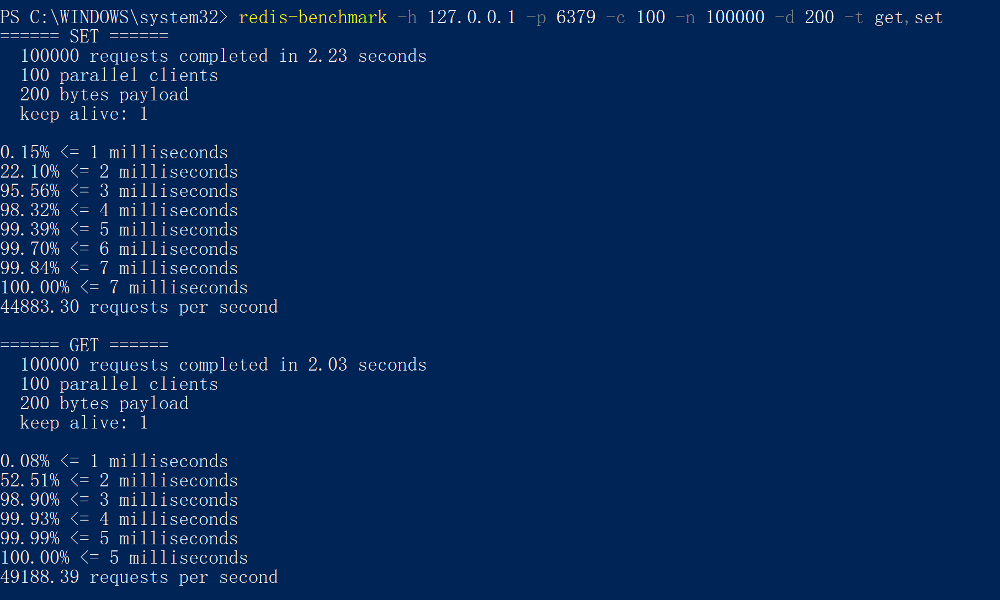
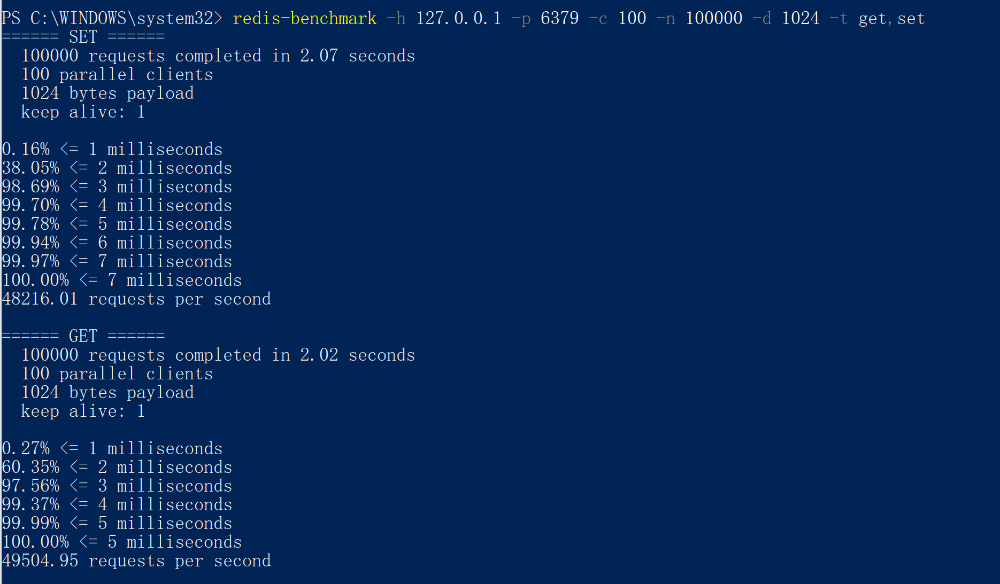
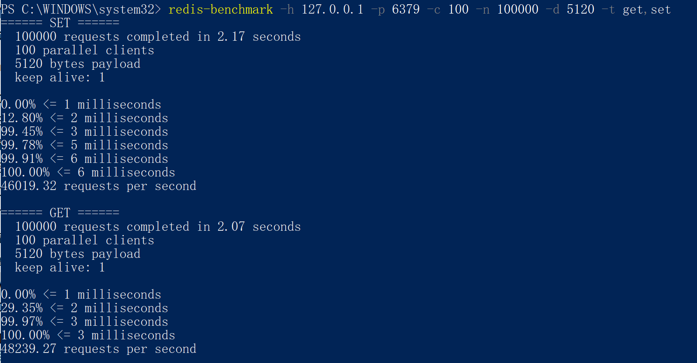

1. 使用 redis benchmark 工具, 测试 10 20 50 100 200 1k 5k 字节 value 大小，redis get set 性能

   - 测试10字节value大小，redis get，set性能

     

   - 测试20字节value大小，redis get，set性能

     

   - 测试50字节value大小，redis get，set性能

     

   - 测试100字节value大小，redis get，set性能

     

   - 测试200字节value大小，redis get，set性能

     

   - 测试1k字节value大小，redis get，set性能

     

   - 测试5k字节value大小，redis get，set性能

     

     结论：在value数据小于1k的情况下，数据的大小对于reids的效率影响不大。在value数据大于1k的情况下，redis的效率会随着vlaue数据的变大而效率会越低，针对GET和SET方法的话，SET方法受到的影响更大。

2. 写入一定量的 kv 数据, 根据数据大小 1w-50w 自己评估, 结合写入前后的 info memory 信息 , 分析上述不同 value 大小下，平均每个 key 的占用内存空间

   ```cpp
   // 清空当前redis数据库中的所有key
   redis-cli flushdb
   // 获取当前redis数据库中key的数量
   redis-cli dbsize
   // 设置20w条数据
   redis-benchmark -h 127.0.0.1 -p 6379 -t set -r 200000 -n 200000 -d 对应字节大小
   ```

   | 字节大小 | 设置前占用内存(Byte) | 设置后占用内存(Byte) | key数量 | 每个key占用内存(Byte) |
   | :------- | :------------------- | :------------------- | :------ | :-------------------- |
   | 10       | 1043328              | 14247424.00          | 126620  | 104.2812826           |
   | 20       | 1043520              | 16272416.00          | 126610  | 120.2819367           |
   | 50       | 1043712              | 20279776.00          | 126302  | 152.302133            |
   | 100      | 1043904              | 26358976.00          | 126388  | 200.2964838           |
   | 200      | 1044096              | 38514304.00          | 126464  | 296.291498            |
   | 1024     | 1044288              | 206046608.00         | 126209  | 1624.308251           |
   | 5120     | 1044480              | 724906672.00         | 126543  | 5720.286322           |
   | 10240    | 1044672              | 1372926176.00        | 126554  | 10840.2856            |

   结论：redis保存下来的数据占用的内存和你要保存的value所占用的内存是不一致的，他在实现上会有不同的数据结构的信息保存。在value值越来越大的时候，value所占内存和redis保存数据所占内存越接近。

   