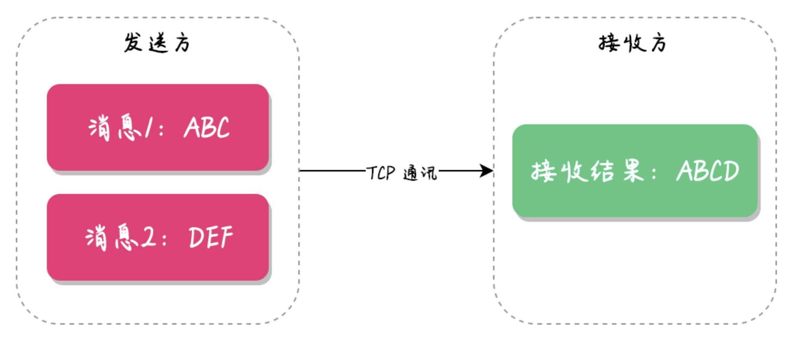
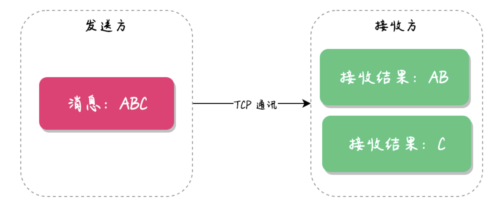

#### 1、总结几种 socket 粘包的解包方式：fix length/delimiter based/length field based frame decoder。尝试举例其应用。

###### 什么是粘包和半包？

- 粘包问题是指当发送两条消息时，比如发送了 ABC 和 DEF，但另一端接收到的却是 ABCD，像这种一次性读取了两条数据的情况就叫做粘包（正常情况应该是一条一条读取的）

  

- 半包问题是指，当发送的消息是 ABC 时，另一端却接收到的是 AB 和 C 两条信息，像这种情况就叫做半包

  

###### 为什么会有粘包和半包？

因为 TCP 是面向连接的传输协议，TCP 传输的数据是**以流的形式**，而**流数据是没有明确的开始结尾边界**，所以 TCP 也没办法判断哪一段流属于一个消息。

粘包的主要原因：

- 发送方每次写入数据 < 套接字（Socket）缓冲区大小；
- 接收方读取套接字（Socket）缓冲区数据不够及时；

半包的主要原因：

- 发送方每次写入数据 > 套接字（Socket）缓冲区大小；
- 发送的数据大于协议的 MTU (Maximum Transmission Unit，最大传输单元)，因此必须拆包；

###### 如何处理粘包

1、fix length：发送方，每次发送固定长度的数据，并且不超过缓冲区，接受方每次按固定长度区接受数据；**即每次发送固定缓冲区大小**；客户端和服务器约定每次发送请求的大小；例如客户端发送1024个字节，服务器接受1024个字节。这样虽然可以解决粘包的问题，但是如果发送的数据小于1024个字节，就会导致数据内存冗余和浪费；且如果发送请求大于1024字节，会出现半包的问题。

```go
// 服务端 fix length
func server_tcp_fix_length(conn net.Conn) {
  fmt.Println("server, fix length")
  const (
    BYTE_LENGTH = 1024
  )

  for {
    var buf = make([]byte, BYTE_LENGTH)
    _, err := conn.Read(buf)
    if err != nil {
      fmt.Println(err)
      return
    }

    fmt.Println("client data :", string(buf))
  }
}

// 客户端 fix length
func client_tcp_fix_length(conn net.Conn) {
  fmt.Println("client, fix length")
  sendByte := make([]byte, 1024)
  sendMsg := "{\"test01\":1,\"test02\",2}"
  for i := 0; i < 1000; i++ {
    tempByte := []byte(sendMsg)
    for j := 0; j < len(tempByte) && j < 1024; j++ {
      sendByte[j] = tempByte[j]
    }
    _, err := conn.Write(sendByte)
    if err != nil {
      fmt.Println(err, ",err index=", i)
      return
    }
    fmt.Println("send over once")
  }
}
```

2、delimiter based：发送方，在数据包添加特殊的分隔符，用来标记数据包边界；这种方式的缺点**在于如果数据量过大，查找定界符会消耗一些性能**。

```go
// 服务端 delimiter based
func server_tcp_delimiter(conn net.Conn) {
  fmt.Println("server, delimiter based")

  reader := bufio.NewReader(conn)
  for {
    slice, err := reader.ReadSlice('\n')
    if err != nil {
      continue
    }
    fmt.Printf("%s", slice)
  }
}

// 客户端 delimiter based
func client_tcp_delimiter(conn net.Conn) {
  fmt.Println("client, delimiter based")
  var sendMsgs string
  sendMsg := "{\"test01\":1,\"test02\",2}\n"
  for i := 0; i < 1000; i++ {
    sendMsgs += sendMsg
    _, err := conn.Write([]byte(sendMsgs))
    if err != nil {
      fmt.Println(err, ",err index=", i)
      return
    }
    fmt.Println("send over once")
  }
}
```

3、length field based frame decoder：在TCP协议头里面写入每次发送请求的长度。 客户端在协议头里面带入数据长度，服务器在接收到请求后，根据协议头里面的数据长度来决定接受多少数据。

```go
// 服务端 length field based frame decoder
func server_tcp_frame_decoder(conn net.Conn) {
  fmt.Println("server, length field based frame decoder")
  var buf = make([]byte, 0)
  var readerChannel = make(chan []byte, 16)
  go func() {
    select {
    case data := <-readerChannel:
      fmt.Println("channel=", string(data))
    }
  }()

  buffer := make([]byte, 1024)
  for {
    n, err := conn.Read(buffer)
    if err != nil {
      fmt.Println(conn.RemoteAddr().String(), " connection error: ", err)
      return
    }

    protocol.Unpack(append(buf, buffer[:n]...), readerChannel)
  }
}

// 客户端 length field based frame decoder
func client_tcp_frame_decoder(conn net.Conn) {
  fmt.Println("client, length field based frame decoder")
  for i := 0; i < 1000; i++ {
    sendMsg := "{\"test01\":1,\"test02\",2}"
    _, err := conn.Write(protocol.Packet([]byte(sendMsg)))
    if err != nil {
      fmt.Println(err, ",err index=", i)
      return
    }
    fmt.Println("send over once")
  }
}

// protocol 自定义协议头

const (
  ConstHeader         = "www.baidu.com"
  ConstHeaderLength   = 13
  ConstSaveDataLength = 4
)

// 封包
func Packet(message []byte) []byte {
  // 头部信息 + body长度 + 消息
  return append(append([]byte(ConstHeader), IntToBytes(len(message))...), message...)
}

// 解包
func Unpack(buffer []byte, readerChannel chan []byte) []byte {
  length := len(buffer)

  var i int
  for i = 0; i < length; i++ {
    if length < i+ConstHeaderLength+ConstSaveDataLength { // 长度为最小头部信息长（不包含）
      break
    }
    if string(buffer[i:i+ConstHeaderLength]) == ConstHeader { // 是否是我们约定的头部信息
      messageLength := BytesToInt(buffer[i+ConstHeaderLength : i+ConstHeaderLength+ConstSaveDataLength]) // 信息body长度
      if length < i+ConstHeaderLength+ConstSaveDataLength+messageLength {
        break
      }
      data := buffer[i+ConstHeaderLength+ConstSaveDataLength : i+ConstHeaderLength+ConstSaveDataLength+messageLength] // 信息
      readerChannel <- data

      i += ConstHeaderLength + ConstSaveDataLength + messageLength - 1 // end index
    }
  }

  if i == length { // 没有找到我们约定的头部信息, return empty []byte
    return make([]byte, 0)
  }
  return buffer[i:] // return message
}
```


#### 实现一个从 socket connection 中解码出 goim 协议的解码器

见main.go